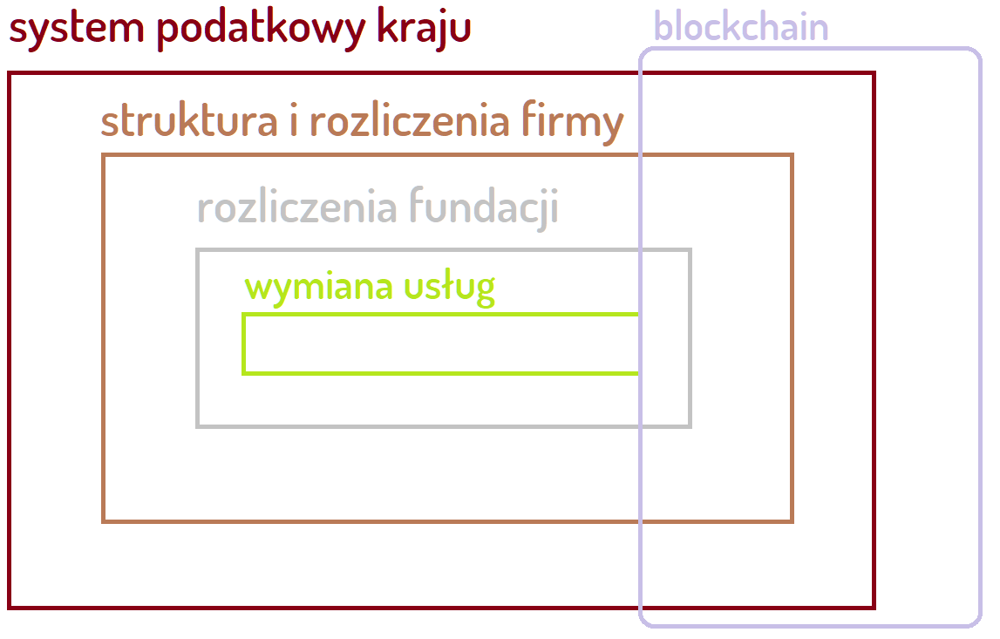
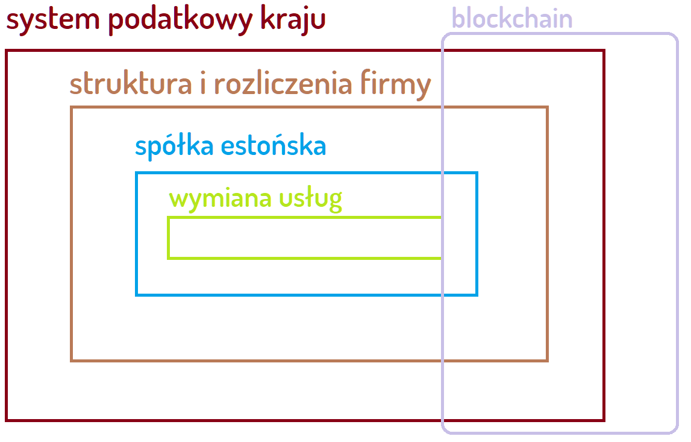

# [Czym jest dobrowolność?](https://www.dobrowolnosc.pl/)

Dobro i Wolność nie mają ceny

# Eksperyment społeczny: blockchain
Implementacja rzeczywistości w zapisie blockchain za pomocą istniejących form prawnych w Polsce.

# Wstęp

## Powód

Trudno się nie zgodzić, że obecny stan prawny w Polsce jest niestabilny.

Pytanie jakie się rodzi to:

+ Jakie rozwiązanie pozwoli zniwelować szkodliwe skutki polityki rządu?

## Rozwiązanie

Eksperyment jest szansą wypracowania rozwiązania poprzez zastosowanie technologii blockchain.

Wyniki pozwolą na ocenę wpływu technologii blockchain na całą społeczność.

Rezultatem eksperymentu ma być wypracowanie warstwy stabilizującej obecne problemy prawne i społeczne.

# Tło

## Agenda 2030

Z obserwacji wydarzeń w ostatnim roku 2020 łatwo można zauważyć pewną specyfikę obecnych czasów.
Istota demokracji polegająca na rządach ludu choćby w referendach nie jest realizowana.
+ [Demokracja](https://pl.wikipedia.org/wiki/Demokracja)

To jaki system przeważa nie zależy od samych zapisów prawa a od jego egzekwowania zgodnie a nie ponad prawem.
Niestety wielu odczuło w czasie Lockdown'u, że prawo silniejszego to najbardziej aktualne prawo.

Agenda 2030 to nie inicjatywa rządów a ludzi korporacji wpływających na zmiany na poziomie kraju poprzez lobbing.

Rezultaty działań Agendy 2030 dotyczą całego globu i nie jest możliwe jej powstrzymanie, dlatego tym bardziej warto zrozumieć już dziś rezultaty tego planu na najbliższą dekadę.

## Pytania

Warto poznać w praktyce rezultaty przeprowadzając opisywany w tym dokumencie eksperyment, mając mozłiwość przekonujać się czym jest ta agenda:
+ czy agenda 2030 uchroni nas przed skutkami tego z czym oficjalnie mówi, że walczy?
+ co jeśli agenda 2030 poniesie fiasko i zamiast tego co planowała przyniesie odwrotne skutki?
+ Jak zmieni się stan własności przecietnej osoby w roku 2030?
+ Jak zmieni się model i jakość życia?
+ Jak wzrosną koszty życia i energii oraz surowców?
+ jak zmieni się ilość ludności, starszych osób?
+ Jakie w praktyce będzie miała prawa jednostka, o czym będzie mogła decydować ?
+ Do czego wystarczy dochód podstawowy?
+ Od czego będzie uzależniony dochód podstawowy i czy będzie można funkcjonować bez niego?
+ jak wpłynie to na zdrowie i opiekę medyczną?
+ Jak zmieni się ilość niewolników na świecie oraz ilość obozów koncentracyjnych?

## Wartości

Wartości są ideą, nie mają miary. 
+ 99% prawdy to kłamstwo
+ 99% wolności to niewola

Bierność to też decyzja

+ [System wartości – Encyklopedia Zarządzania](https://mfiles.pl/pl/index.php/System_warto%C5%9Bci)
+ [Prawo natury – Wikipedia, wolna encyklopedia](https://pl.wikipedia.org/wiki/Prawo_natury)

## Obywatel i rząd

Populacja człowieka jest zdeterminowana jego zdolnością do rozmnażania.
Zdolność ta w Europie maleja z roku na rok na skutek szkodliwych działań organizacji współpracujących z rządami.

Ludzie wolni, szukają rozwiązań zgodnych z prawem.
Obecnie tocząca się wojna rodzi konflikty moralne z powodu siłowych rozwiązań rządów wielu krajów.
Rządy łamią prawo na prędce ustanawiane, burząc zaufanie i ład, egzekwując wadliwe prawo wprowadzają chaos.

## System

Czym jest obecnie funkcjonujący system i jakie są jego cele?
- zespół wzajemnie powiązanych elementów realizujących jako całość założone cele

+ [System](https://pl.wikipedia.org/wiki/System)

Cele systemu nigdy nie były i nie będą zbieżne z pojedynczą jednostką, człowiekiem, który cele zmienia z dnia na dzień, gdyż są zależne od wielu zmiennych:
+ stan jednostki, samopoczucie, zdrowie, emocje, duchowość
+ stan otoczenia, środowiska, rodziny
+ stan finansowy, możności i zdolności do działania
+ determinacja wynikająca z powyższych

# Technologia

## Blockchain

Blockchain jako sposób zapisu transakcji i informacji nie był pierwszym, gdyż od kilkudziesięciu lat są rozwijane różne metody zapisu i strukturyzacji danych.
Nawet ten dokument przeze mnie pisany jest oparty o rozproszony system zapisu plików nazywany systemem kontroli wersji (plików) Git, w pewnych kwestiach podobny do technologii blockchain.

+ [git](https://pl.wikipedia.org/wiki/Git_(oprogramowanie))
+ [blockchain](https://pl.wikipedia.org/wiki/Blockchain)

## Fizyka a praca człowieka

Techniczne aspekty, przydatne przy rozliczaniu się wzajemnie z usług, możliwe do wykorzystania w barterze blockchain:

Jednostkę miary która jednoznaczna i nie kwestionowalna to czas

+ [Czas](https://pl.wikipedia.org/wiki/Czas)

Poprzez pomiar energii następującej w czasie możemy wyliczyć rezultaty:

+ [Praca W, Moc P, Czas t](https://pl.wikipedia.org/wiki/Moc)

    W = P * t

Praca W jest wynikiem użytej Energii/Mocy w czasie t.

Teoria a rzeczywistosć

Na codzień rozliczamy się za rezultaty pracy lub spędzony czas nad nimi.
Rozliczenie następuje za pośrednie możliwe do zmierzenia bądź oszacowania wartości a nie bezpośrednio za włożoną w wyniki pracy energię.

Samochód spalający paliwo ma zmienną sprawność w zależności od warunków pracy i otoczenia (np. temperatury),
dlatego ilość włożonej energii nie jest proprocjonalna do ilości przejechanej drogi i spalonej ilości paliwa.

# Aspekty prawne

## Umowa

Formy umowy pozwalaja na inne sposoby oceniania rezultaty niezależnie od pracy włożonej i czasu na to przeznaczonego.
Samo istnienie potencjału/energii nie jest opłatowane**
Sam fakt zaistnienia zdarzenia ma różne konteksty

## Rozliczenia

Rozwiązania prawne wdrożone w całym ekosystemie powinny pomóc w przeprowadzeniu eksperymentu bez skutków opłatowych*, by wyniki nie był zachwiane poprzez zmienną politykę rządów, które coraz częściej zmieniają warunki otoczenia i wcale nie zamierzają stabilizować prawa a jeśli tak to z korzyścią dla siebie narzucając inne opłaty* np. od obrotu jako dodatkowe opłaty* a nie alternatywne.

Warto rozważyć obecny stan prawny majacy wpływ na strukturę organizacyjną oraz na sposób rozliczeń.

# Model dla osób prywatnych

## Przykładowy model
Ten model jest przeznaczony dla osób prywatnych, model dla firm byłby uproszczony i nie zawierałby fundacji.

Dwie Fundacje dla potrzeb pobierania i przesyłania środków bez opłat* pomiędzy użytkownikami w ramach celów statusowych (ekpserymentu).

    + przelew wchodzacy od osoby prywatnej/prawnej
        1 spółka: księguje przychód
          2 fundacja: otrzymuje darowiznę
            + transakcja wymiany zapisywana w blockchain: osoba <-> osoba
          3 fundacja: wysyła darowiznę do innej fundacji lub firmy
        4 spółka: otrzymuje pieniadze od firmy lub fundacji
    + przelew wychodzący do osoby prywatnej/prawnej

## Cechy modelu:

Przeznacznie
+ system zewnętrzny 1 i 4 używa jednostek monetarnych
+ system wewnętrzny 2 i 3 zapisu zdarzeń w technologii blockchain
+ elementy 2 i 3 mogą być wielokrotnie powielane w czasie co da możliwość rozrastania się systemu niezależnie od miejsca

Transfery
+ transfer barterowy pomiędzy jednostkami odbywa sie w wewnętrznym systemie 2 i 3 
+ transfer wartości skalarnych odbywa się pomiędzy systemem użwającym jednostek 1 i 4 (zewnętrzny) a systemem globalnym poza tą strukturą
    + tak by była ciągłość wymiany i by system blockchain mógł angażować coraz więcej ludzi niezależnie od lokalizacji na świecie

Taka podstawowa struktura umożlwia realizację w blockchaine rozliczeń, powinna uniezależnić jednostki funkcjonujące w jej systemie od systemu zewnętrznego

Warto rozróżnić dwie kwestie: prawne i opłatowe*
+ prawo działa na podstawie zawartych umów
+ opłaty* tylko na zewnątrz
+ wewnątrz zero kosztów, opłat* systemowych tylko czysty zapis transakcji

# Zasada działania 

## transakcja wymiany

Na podstawie transakcji opłacanej z góry
+ dwie osoby chcą dokonać transakcji wymiany, np usługa korepetycji
+ Korepetytor inicjuje transakcje
+ Uczeń ją akceptuje i wpłaca na kontę firmy [element 1]
    + [elementy 1 i 4] wymagają danych opartych o wartości (waluty) przypisanej do konta bankowego konkretnego człowieka/organizacji na zewnątrz systemu
+ Opłata jest odnotowana w firmie i przelewana na konto fundacji realizującej transakcję pomiędzy osobami w technologii blockchain
    + [elementy 2 i 3] (wewnętrzne) przeprowadzają wymianę w systemie blockchain
+ Korepetytor nie otrzymuje pieniędzy a jedynie informację, że opłata została wniesiona do systemu blockchain
+ Usługa zostaje wykonana, uczeń wystawia pozytywny komentarz
+ Pieniądze za wykonaną usługę mogą zostać wypłacone na zewnątrz systemu blockchain, wówczas zostaje zainicjowany przelew w [elemencie 4]
+ Po wypłaceniu konieczne będzie rozliczenie się z odpowiednimi urzedami w zależności od jurysdykcji 

## Proces wchodzenia i wychodzenie jednostek z systemu (do opracowania)

## Proces zwiększania i zmniejszania ilości jednostek w systemie wewnętrznym i zewnętrznym (do opracowania)

# Model dla osób prawnych

## Przykładowy model
Ten model jest przeznaczony dla osób prywatnych, model dla firm byłby uproszczony i nie zawierałby fundacji.

Dwie Fundacje dla potrzeb pobierania i przesyłania środków bez opłat* pomiędzy użytkownikami w ramach celów statusowych (ekpserymentu).

    + przelew wchodzacy od osoby prawnej
        1 spółka rezydencji: księguje przychód
          2 spółka estońska: otrzymuje wpłatę z kraju rezydencji
            + transakcja wymiany zapisywana w blockchain: firma <-> firma
          3 spółka estońska: wysyła przelew do innej firmy
        4 spółka rezydencji: otrzymuje pieniadze od firmy
    + przelew wychodzący do osoby prawnej

# Podsumowanie

## Dla kogo może być przydatny eksperyment oraz wnioski po jego przeprowadzeniu

+ Dla każdego kto chce w praktyce sprawdzić korzyści i wady przy rozliczaniach metod w technologii blockchain.
+ Dla entuzjastów technologii blockchain chcących pogłębić swoją wiedzę i doświadczyć tego co czeka ich za dekadę.
+ Dla naukowców mających wiedzę w opisywanej technologii i prawie międzynarodowym, chcących się podzielić się wiedzą i wynikami swoich prac
+ Dla ludzi szukających inspiracji

## Pytania

Inflacja wartości:
+ Czy będzie istniała i na jakim poziomie inflacja wartości subiektywnej (zapisanych zdarzeń) i obiektywnej (jednostek monetarnych) tego systemu?
+ Czy i kiedy była by możliwa?

Struktura modelu:
+ zmiana struktury, w jaki sposób, jak często?
+ Jak w elementach modelu 2 i 3 transferować rezultaty zdarzeń pomiędzy jednostkami bezpośrednio, bez udziału elementów 1 i 4?
+ Jakie były by koszty prowadzenia tych sformalizowanych form?
+ Ile takich modeli trzeba by było zmultiplikować w zależności od liczby, przyrostu nowych wolontariuszy?
+ Jak ubrać determinację jednostki do realizacji celów tak, by nie stały w konflikcie z zastanymi i istniejącymi systemami majacymi często sprzeczne, inne cele ?
+ Jak podjąć temat zwiększenia efektywności pozyskiwania dóbr bez udziału świata finansów przygotowanych przez (lokalny i globalny) system?

# Autor specyfikacji

Tomasz Sapletta

Poniżej zamieszczam odpowiedź na pytanie, Dlaczego warto to zrobić w Polsce?

na dzień dzisiejszy trzeba się odnaleźć w prawnym bałaganie w Polsce, gdzie łatwiej przeprowadzić eksperyment z punktu widzenia znajomości kultury i łatwiejszego dostępu do specjalistów korzystających z alternatywnych rozwiązań.

Polacy z reguły szukają korzystnych rozwiązań poza granicami, świadczy o tym choćby przerejstrowywanie firm z Polski do UK i innych krajów świata.

Ten ekosystem do rozliczeń ma być dodatkową warstwa abstrakcji wykorzystując zastane środowisko. 
Ma być mostem pomiędzy tym co jest teraz i będzie po resecie i dekadę dalej.
Wszelkie nagłe zmiany odbijają się czkawką, dlatego w tym ekosystemie blockchain widzę możliwość stabilizacji zewnętrznych skutków prawnych i społecznych.

